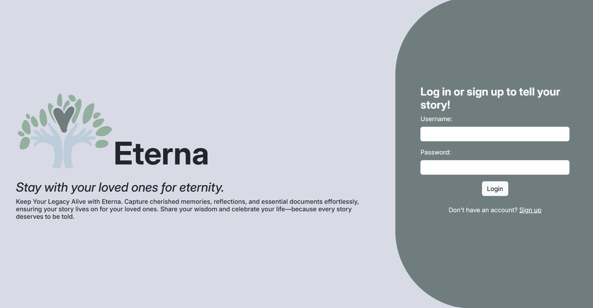

# Dubhacks 2024

Project created during the 2024 Dubhacks hackathon

Authors: Cleo, Keira, Chelsea, Derek

## Inspiration

Today's digital world has slowly transformed the ways we approach the afterlife, mourning, and memorialization. As described in the book The _Creation and Inheritance of Digital Afterlives_ by Debra J. Basset, modern social media sites such as “Facebook, Twitter, and WhatsApp 'accidentally' enable and nurture the creation of digital afterlives” which gave rise to the idea of digit inheritance and digital death (Basset). These platforms, initially designed for real-time interactions, now serve as spaces where the living can maintain connections with the deceased through preserved profiles, posts, and messages. Using this idea, there is potential to initiate postmortal communication and create the idea of digital memorialization. By addressing this problem domain, it is possible to provide a place for people to leave digital artifacts for peace of mind and communication with loved ones while protecting sensitive data. 

## What it does

Eterna is a web application designed to store personal messages, final wishes, and documents could provide a more intentional and secure way for individuals to maintain control over their digital legacy. Users are able to upload various forms of media to preserve for an end-of-life event. These digital artifacts will be sent to loved ones when the time is right.

## How we built it

The concept was drafted up using Figma to help visualize and plan the layout of the web pages. In order to build the web application, we utilized React.js, HTML, CSS, and Node.js. To ensure proper authentication and data persistence, Auth0 and MongoDB Atlas were used. However, due to time restrictions, these technologies were not fully integrated into Eterna.

## Challenges we ran into

Developing Eterna presented us with many obstacles especially since most of our team members are new to web development. However, we wanted to do our best work on a topic that To ensure that we were tackling a meaningful problem, we dedicated a considerable amount of time to identify a problem domain and a potential solution to address it. Afterwards, a significant amount of time was allocated towards reading through documentation on technologies we were not familiar with. 

## Accomplishments that we're proud of

We are proud to have a functional product to present successfully that was a product of collaboration and creativity. We believe that we have identified a problem domain that needs to be addressed and established a clear path for future development.

## What we learned

While developing Eterna, we learned to think about pain points unaddressed by today's web applications by brainstorming from a user's perspective and exploring new solutions. We also gained insight from mentors on how to foster approachability for a sensitive problem space. As for the technical aspect, we developed knowledge in the realm of React webpage routing.  

## What's next for Eterna

- finish integration of Auth0 and MongoDB Atlas
- add a way to confirm user activity
- add customizable authentication
- access to legal, counseling, and community support

